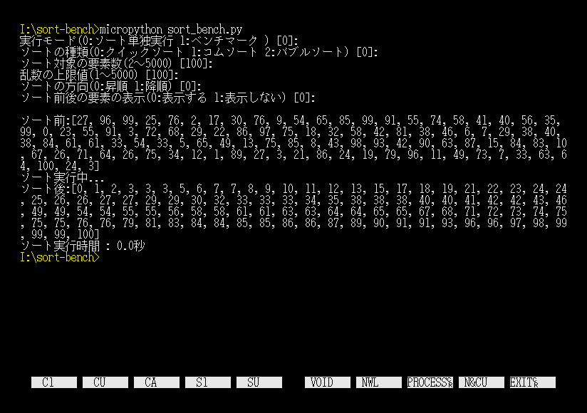
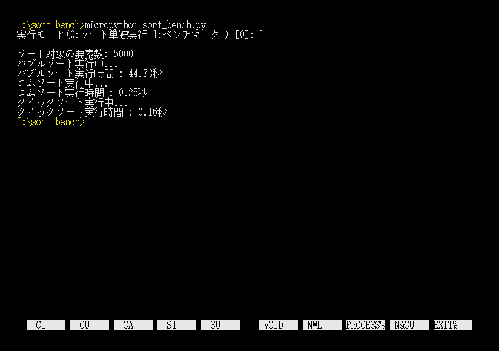

# sort-bench
自作のソートの外部関数を使用した[MicroPython for X680x0](https://github.com/yunkya2/micropython-x68k/tree/port-x68k/ports/x68k)によるソートのベンチマークプログラムです。   
バブルソート、コムソート、クイックソートの実行が可能です。

## 実行方法
カレントディレクトリにSORT.FNCとsort_bench.pyを配置し、以下を実行します。
```
micropython sort_bench.py
```
実行後は、対話形式で必要なパラメータを入力します。

ソート単独実行時   
[](./images/sortl.png)   
ベンチマーク実行時   
[](./images/sort2.png)   

ベンチマーク時のソートの要素数を変更したい場合は、sort_bench.pyのBENCH_DATA_NUMを変更してください。

## 外部関数リファレンス
SORT.FNCに含まれる外部関数のリファレンスは以下となります。
| 関数名 | 書式 | 引数 | 戻り値 |
| ---- | ---- | ---- | ---- |
|  バブルソート   |  bubble_sort(sort_data, sort_num, [order])  | <dl><dt>sort_data:</dt><dd>1次元配列名</dd><dt>sort_num:</dt><dd>sort_dataに含まれる配列数</dd><dt>order:</dt><dd>0は昇順、0以外は降順(省略時は昇順)</dd></dl> | 無し |
|  コムソート   |  comb_sort(sort_data, sort_num, [order])  | 上記同様 | 無し |
|  クイックソート   |  quick_sort(sort_data, sort_num, [order])  | 上記同様 | 無し |


## 外部関数のビルド方法
外部関数であるSORT.FNCのビルドはyosshinさんの[xdev68k](https://github.com/yosshin4004/xdev68k)を使用させていただいています。

xdev68kの環境構築後に、bashコンソールで以下を実行してください。
```
cd src
make
```

## ライセンス
sort-benchはMITライセンスを適用しています。
